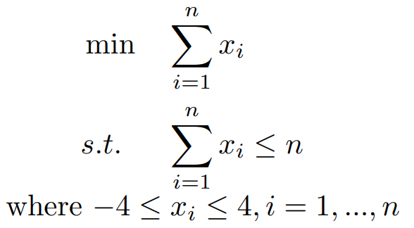

# DIRECTGOLib - DIRECT Global Optimization test problems Library

With the introduction of **DIRECTGOLib** (which stands as **DIRECT** **G**lobal **O**ptimization test problems **Lib**rary), we present a new and an actively growing online collection of the box- and generally-constrained  test and engineering problems for **DIRECT** (**DI**viding **RECT**angles)-type global optimization [[5]](https://link.springer.com/article/10.1007/BF00941892). 

**DIRECTGOLib** is a continuation of of our previous **DIRECTLib** library [[11]](https://zenodo.org/record/3948890#.YmbmBYtBxaR), which was widely used in different studies (see, e.g., [[6](https://link.springer.com/book/10.1007/978-1-4614-9093-7), [7](https://link.springer.com/article/10.1007/s11590-017-1228-4), [8](https://link.springer.com/article/10.1007/s00158-018-2181-2), [9](https://link.springer.com/article/10.1007/s11590-021-01726-z), [10](https://www.sciencedirect.com/science/article/abs/pii/S0096300320305518)]). However, **DIRECTLib** was designed as a static library and did not offer the global optimization community comfortable opportunities to contribute to its growth. Therefore, a new **DIRECTGOLib** is designed as an open-source GitHub repository to which other researchers can easily contribute. 

Moreover, all the problems are described using `MATLAB` programming language and syntax, seeking maximum usability with our recently introduced open-source tool: [DIRECTGO: A new DIRECT-type toolbox for derivative-free Global Optimization](https://github.com/blockchain-group/DIRECTGO).

---

## Problems
There already exist various collections of [global optimization test problems](https://github.com/ekhoda/optimization_problem_libraries#global-optimization). The uniqueness of this collection is that it mainly concentrates on problems commonly used to test various DIRECT-type algorithms with at least one reliable source of experimental results.  

While the problems are gathered from the various sources but below we highlight a few that form an essential part of the current version:
- **Global Optimization Test Problems (Hedar list)** [[1]](http://www-optima.amp.i.kyoto-u.ac.jp/member/student/hedar/Hedar_files/TestGO.htm)
- **Virtual Library of Simulation Experiments: Test Functions and Datasets** [[2]](http://www.sfu.ca/~ssurjano/index.html)
- **CEC2006 benchmark set** [[3]](https://www.semanticscholar.org/paper/Problem-Deflnitions-and-Evaluation-Criteria-for-the-Liang-Runarsson/c8360687b24fba42bd284e0887807497433e4d39)
- **Global bound and linear constrained problems** [[4]](http://www.norg.uminho.pt/aivaz/pswarm/)
- **Parameter estimation in the general non-linear regression model** [[12]](https://www.intlpress.com/site/pub/pages/journals/items/sii/content/vols/0010/0001/a006/)
- **Engineering design examples** [[13]](https://ieeexplore.ieee.org/document/1223578)

---

## Classification
Based on the type of constraints, continuous global optimization test problems from **DIRECTGOLib** are classified into three main categories:
- [Box-constrained](https://github.com/blockchain-group/DIRECTGOLib/tree/main/Box) (55 problems in total)
- [Linearly-constrained](https://github.com/blockchain-group/DIRECTGOLib/tree/main/Linear) (35 problems in total)
- [Generally-constrained](https://github.com/blockchain-group/DIRECTGOLib/tree/main/General) (39 problems in total)

We also separate problems coming from practical applications:
- [Engineering problems](https://github.com/blockchain-group/DIRECTGOLib/tree/main/Engineering) (11 problems in total).

---

## Contribution to DIRECTGOLib
We welcome contributions and corrections to this resource either way:

- **By email** - send us new problems, corrections, or suggestions by email: linas.stripinis@mif.vu.lt or remigijus.paulavicius@mif.vu.lt.
- **GitHub way** - fork the GitHub repository, add new problems or correct existing ones, then create a pull request, and we gratefully incorporate your contribution!

New problems should be described using `MATLAB` programming language and the following syntax guidelines (compatible with all DIRECT solvers from [DIRECTGO](https://github.com/blockchain-group/DIRECTGO)).

### An example of `Tproblem` description

Mathematical formulation:



Description in `MATLAB`:


```matlab
function y = Tproblem(x)                 
    if nargin == 0			    % Extract info from the problem:
        y.nx = 0;                             % Dimension of the problem
        y.ng = 1;                             % Number of g(x) constraints
        y.nh = 0;                             % Number of h(x) constraints
        y.xl = @(i) -4;                       % Lower bounds for each variable
        y.xu = @(i) 4;			      % Upper bounds for each variable
        y.fmin = @(nx) get_fmin(nx);          % Known solution value
        y.xmin = @(nx) get_xmin(nx);          % Known solution point
        y.confun = @(i) Tproblemc(i);         % Constraint functions
        return
    end
    if size(x, 2) > size(x, 1)              % If x is a row transpose to column          
        x = x';
    end
    y = sum(x);	        		    % Return function value at x
end

function [c, ceq] = Tproblemc(x)	    % Return constraint functions
	c = sum(x.^2) - length(x);
	ceq = [];
end

function fmin = get_fmin(nx)		    % Return function which calculates minima value
    fmin = -nx;
end

function xmin = get_xmin(nx)		    % Return function which calculates minima point
    xmin = -ones(nx, 1);
end
```

All the information needed for the algorithms about test functions is available programmatically. 
- Whenever the `MATLAB` code for the objective function is called with no arguments, the routine return a `MATLAB` structure `y` with all the necessary fields.
- The value `y.nx = 0` means that the test problem is various dimensionality that can be settled by the user.
- The `x` vector passed to a test problem can be either the column or a row vector.

---

## Cite DIRECTGOLib
Please use the following bibtex entry, if you consider to cite **DIRECTGOLib**:

```latex
@misc{linas_stripinis_2022_04,
  author       = {Linas Stripinis and Remigijus Paulavicius},
  title        = {{DIRECTGOLib - a library of global optimization problems for DIRECT-type methods}},
  month        = April,
  year         = 2022,
  publisher    = {Zenodo},
  version      = {1.0},
  doi          = {10.5281/zenodo.5830927},
  url          = {https://doi.org/10.5281/zenodo.5830927}
}
```

## Changelog

### [v1.1](https://github.com/blockchain-group/DIRECTGOLib/releases/tag/v1.1) - (2022-04-26)

**Added**

Eight new [box-constrained](https://github.com/blockchain-group/DIRECTGOLib/tree/main/Box) global optimization test problems:

- `Crosslegtable.m`
- `Damavandi.m`
- `Deb01.m`
- `Deb02.m`
- `Permdb4.m`
- `Pinter.m`
- `Trefethen.m`
- `Vincent.m`

**Modified**

One [box-constrained](https://github.com/blockchain-group/DIRECTGOLib/tree/main/Box) global optimization test problem:

- `Trid10.m`

## References

1. [A. Hedar. 2005. Test functions for unconstrained global optimization. http://www-optima.amp.i.kyoto-u.ac.jp/member/student/hedar/Hedar_files/TestGO.htm](http://www-optima.amp.i.kyoto-u.ac.jp/member/student/hedar/Hedar_files/TestGO.htm).
2. [S. Surjanovic and D. Bingham. 2013. Virtual Library of Simulation Experiments: Test Functions and Datasets. http://www.sfu.ca/~ssurjano/index.html](http://www.sfu.ca/~ssurjano/index.html).
3. [Jing Liang, Thomas Runarsson, Efrén Mezura-Montes, M. Clerc, Ponnuthurai Suganthan, Carlos Coello, and Kalyan Deb. 2006. Problem definitions and evaluation criteria for the CEC 2006 special session on constrained real-parameter optimization. Nangyang Technological University, Singapore, Tech. Rep 41 (01 2006), 251–256](https://www.semanticscholar.org/paper/Problem-Deflnitions-and-Evaluation-Criteria-for-the-Liang-Runarsson/c8360687b24fba42bd284e0887807497433e4d39)
4. [A.I.F. Vaz and L.N.Vicente, A particle swarm pattern search method for bound constrained global optimization, Journal of Global Optimization, 39 (2007) 197-219.](http://www.norg.uminho.pt/aivaz/pswarm/)
5. [Jones, D.R., Perttunen, C.D. & Stuckman, B.E. Lipschitzian optimization without the Lipschitz constant. J Optim Theory Appl 79, 157–181 (1993). https://doi.org/10.1007/BF00941892](https://link.springer.com/article/10.1007/BF00941892).
6. [R. Paulavičius, J. Žilinskas. (2014) Simplicial Global Optimization, SpringerBriefs in Optimization, Springer New York, New York, NY. doi:10.1007/978-1-4614-9093-7](https://link.springer.com/book/10.1007/978-1-4614-9093-7).
7. [Stripinis, L., Paulavičius, R. & Žilinskas, J. Improved scheme for selection of potentially optimal hyper-rectangles in DIRECT. Optim Lett 12, 1699–1712 (2018). https://doi.org/10.1007/s11590-017-1228-4](https://link.springer.com/article/10.1007/s11590-017-1228-4).
8. [Stripinis, L., Paulavičius, R. & Žilinskas, J. Penalty functions and two-step selection procedure based DIRECT-type algorithm for constrained global optimization. Struct Multidisc Optim 59, 2155–2175 (2019). https://doi.org/10.1007/s00158-018-2181-2](https://link.springer.com/article/10.1007/s00158-018-2181-2).
9. [Stripinis, L., Paulavičius, R. A new DIRECT-GLh algorithm for global optimization with hidden constraints. Optim Lett 15, 1865–1884 (2021). https://doi.org/10.1007/s11590-021-01726-z](https://link.springer.com/article/10.1007/s11590-021-01726-z).
10. [Stripinis, L., Žilinskas, J., Casado, L. G., & Paulavičius, R. (2021). On MATLAB experience in accelerating DIRECT-GLce algorithm for constrained global optimization through dynamic data structures and parallelization. Applied Mathematics and Computation, 390, 125596. https://doi.org/https://doi.org/10.1016/j.amc.2020.125596](https://www.sciencedirect.com/science/article/abs/pii/S0096300320305518).
11. [Stripinis, L. & Paulavičius, R. 2020. DIRECTLib – a library of global optimization problems for DIRECT-type methods, v1.2. https://doi.org/10.5281/zenodo.3948890](https://zenodo.org/record/3948890#.YmbmBYtBxaR).
12. [J. Gillard and D. Kvasov. 2017. Lipschitz optimization methods for fitting a sum of damped sinusoids to a series of observations. Statistics and Its Interface 10, 1 (2017), 59–70. https://doi.org/10.4310/SII.2017.v10.n1.a6](https://www.intlpress.com/site/pub/pages/journals/items/sii/content/vols/0010/0001/a006/)
13. [Tapabrata Ray and Kim Meow Liew. 2003. Society and civilization: An optimization algorithm based on the simulation of social behavior. IEEE Transactions on Evolutionary Computation 7, 4 (2003), 386–396. https://doi.org/10.1109/TEVC.2003.814902](https://ieeexplore.ieee.org/document/1223578)

